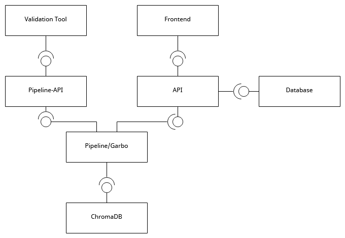

# Garbo Pipeline API

This repository contains an API to interact with the Garbo pipeline for processing company reports. The current scope of the API is to provide endpoints for the validation to query jobs and processes and allow interaction between the Garbo pipeline and the user through validation requests.

The latest run of each Company is shown in the company list.

## Terminology
- **Queue**: A BullMQ queue that holds jobs to be processed. The pipeline consists of many independent queues.
- **Job**: An item in a BullMQ queue. A job contains data (payload) and metadata for processing.
- **Worker**: A BullMQ processor attached to a queue. Each queue has a defined worker that processes jobs from the queue.
- **Pipeline**: A acyclic graph of queues defined by us. The pipeline is defined in the `src/config/pipeline.ts` file.
- **Process**: A whole run of a report through the pipeline. A process is definded by us through a the property `id` in the job data. A process consists of	many jobs.

## API Definition

After running the API, the API definition can be found at [http://localhost:3001/api](http://localhost:3001/api).

## Getting Started

### Deployment in the Garbo Environment 



### Prerequisites

- Node.js (23+)
- npm or yarn
- Running [Garbo Pipeline](https://github.com/Klimatbyran/garbo) (only `npm run dev-workers` necessary)

### Environment Variables

The following environment variables are available:

**Required:**
- `REDIS_HOST`: Redis host (default: `localhost`)
- `REDIS_PORT`: Redis port (default: `6379`)
- `NODE_ENV`: Environment (`development`, `staging`, or `production`, default: `production`)
- `PORT`: API port (default: `3001`)

**Optional:**
- `JWT_SECRET`: Secret key for JWT token validation. Must match the secret used by the main auth API (`api.klimatkollen.se`). **Only required for write operations (POST, PUT, PATCH, DELETE). GET requests work without it.**
- `REDIS_PASSWORD`: Redis password (optional)
- `API_BASE_URL`: Base URL for the API (default: `http://localhost:3001`)

Create a `.env` file in the root directory with these variables.

### Installation

1. Clone the repository
```bash
git clone <repository-url>
cd <repository-directory>
```

2. Install dependencies
```bash
npm install
# or
yarn install
```

3. Start the development server
```bash
npm run dev
# or
yarn dev
```

4. Open your browser and navigate to `http://localhost:3001/api`

## Development

### Project Structure

- `/src`: Source code
  - `/config`: Configuration files
  - `/lib`: General functions and utilities
  - `/middleware`: Middleware functions (JWT authentication)
  - `/routes`: API endpoint definitions
  - `/schemas`: Zod schemas for validation
  - `/services`: Business logic and data processing
- `app.ts`: Fastify application setup
- `index.ts`: Entry point

## Authentication

The API uses JWT (JSON Web Token) authentication to protect **write operations only** (POST, PUT, PATCH, DELETE). This prevents unauthorized pipeline triggers and modifications.

### Protected Operations

**Write operations** (POST, PUT, PATCH, DELETE) on the following paths require authentication:
- `POST /api/queues/:name` - Add jobs to queues
- `POST /api/queues/:name/:id/rerun` - Re-run jobs
- `POST /api/queues/:name/:id/rerun-and-save` - Re-run and save emissions
- `POST /api/queues/rerun-by-worker` - Bulk re-run operations
- Any other write operations on `/api/queues/*`, `/api/processes/*`, or `/api/pipeline/*`

### Unprotected Operations

**Read operations** (GET) are **not protected** by backend authentication:
- All `GET` endpoints are publicly accessible
- Frontend handles authentication for read operations (UX only)
- This allows easier debugging and inspection of pipeline state

### Always Public Endpoints

The following endpoints never require authentication:
- `/api/health` - Health check
- `/api/export/openapi.json` - OpenAPI specification export
- `/api` - API documentation (Scalar UI)

### Using the API

Protected write operations require a JWT token in the `Authorization` header:

```
Authorization: Bearer <your-jwt-token>
```

If a token is missing, invalid, or expired, the API will return a `401 Unauthorized` response.

**Note**: Read operations (GET) do not require authentication tokens, but the frontend may still require login for user experience.
